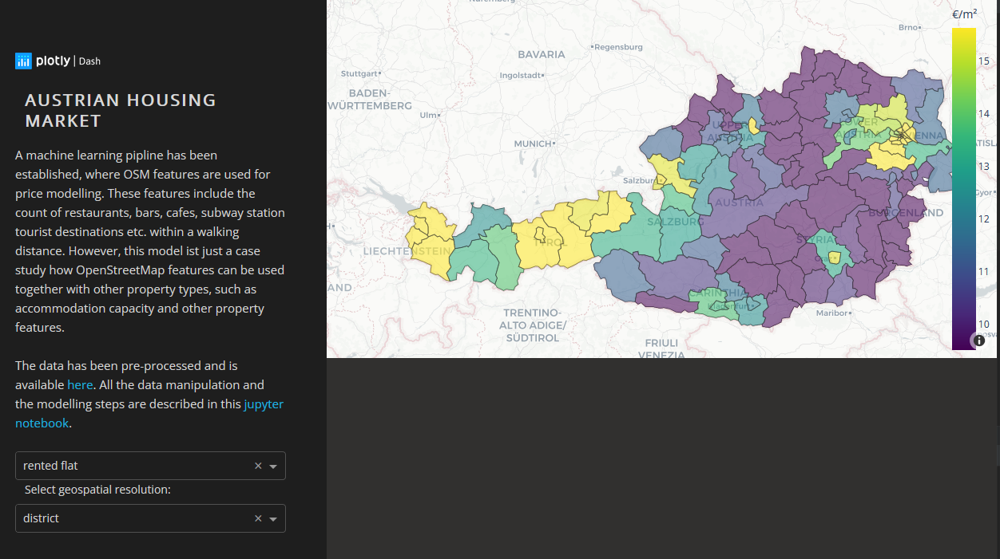

  <h3 align="center">Austrian Housing Market Analysis</h3>
  

    A data-driven analysis using Austrian real estate online platform data
     
    <a href="https://medium.com/@arlin.gruber/how-data-science-can-give-you-an-edge-in-real-estate-investing-1849255d7c33">Summary</a>
  

<!-- TABLE OF CONTENTS -->

  
Table of Contents

  <ol>
    <li>
      <a href="#about-the-project">About The Project</a>
    </li>
    <li>
      <a href="#getting-started">Getting Started</a>
      <ul>
        <li><a href="#installation">Installation</a></li>
        <li><a href="#view-notebook">View Notebook</a></li>
      </ul>
    </li>
    <li><a href="#results">Results</a></li>
  </ol>

### 1. About The Project
Real estate information of a particular region or location is not 
easy to come by. In this notebook we investigate an Austrian real estate data set which has been mined
extracted over the course of a week from a large online portal. The data has already been 
pre-processed and can be geospatial investigated.

This app can be viewed live on Heroku at [https://austrian-housing.herokuapp.com/](https://austrian-housing.herokuapp.com/)

### 2. File Structure

`app.py` main dash app  
`requirements.txt` python modules that will be installed for the web application at build.  
`/assets` this directory is to serve the CSS files and images for the app. `charts.py` is used for generating the figures.  
`layout.py` defines the html web layout, `callbacks.py` handles all the callbacks and `data_wrangling.py` is used
for all the data queries and date manipulation.  
`/data` contains the raw data files. 
`/data/geojson/vienna.geojson` geojson files with the geospatial data of Austria. 
`/nb` notebook used for data exploration and analysis.  
`runtime.txt` tells (the Gunicorn HTTP server) which python version to use (only needed for Heroku deployment) 
`Procfile` defines what type of process is going to run (Gunicorn web process) and the Python app entrypoint
(only needed for a deployment on Heroku)  
`.gitignore` 

### 3. Installation

#### Getting Started

- Change the current directory to the location where you want to clone the repository and run:

`$ git clone https://github.com/AReburg/Austrian-Real-Estate-Analysis.git`
- Make sure that the app is running on the local webserver before deployment.
Setup your virtualenv (or don't) and ensure you have all the modules installed before running the app. 

#### Requirements
Install the modules from the `requirements.txt` with pip3 or conda from a terminal in the project root folder:

`pip install -r requirements.txt`  
`conda install --file requirements.txt` (Anaconda)
 

#### Jupyter Notebook
Executing the notebook is tested on *anaconda distribution 6.4.12.*  with 
*python 3.9.13*.
To view the rendered geospatial charts of the Jupyter notebook go to [nbviewer](https://nbviewer.org/) and
copy the link.

### 4. Usage

#### Local Web Application
- Run the app from your IDE direct, or from the terminal in the projects root directory: `python app.py`

- It should be accessible on the browser `http://127.0.0.1:8050/`

### 5. Results
The main findings are summarized in a [post](https://medium.com/@arlin.gruber/how-data-science-can-give-you-an-edge-in-real-estate-investing-1849255d7c33).
Feel free to contact me if you have any questions or suggestions.

